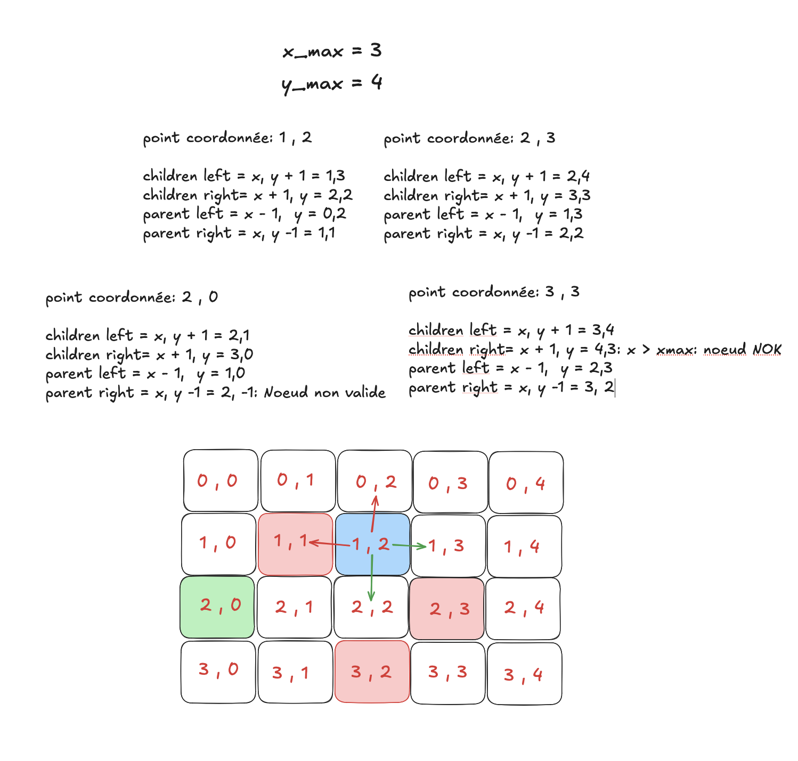
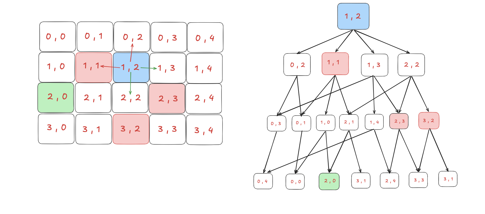

# Pathfinder

Plutôt que d’utiliser directement un algorithme de pathfinding existant, ce projet adopte une approche exploratoire basée sur l’observation de la structure du problème. L’objectif est de concevoir et d’implémenter un algorithme capable de déterminer s’il existe un chemin valide entre un point A et un point B.

Les problèmes comme le pathfinding sur grille ont été étudiés pendant longtemps, donc les solutions efficaces ont déjà été découvertes mais redécouvrir une idée existante par soi-même est une excellente façon de comprendre profondément le problème.


# Etape 1: génération de l’arbre de recherche à partir de la grille 2D

On remarque que chaque nœud a au maximum deux nœuds parents et deux nœuds enfants. Nous pouvons donc établir cette structure de nœud :

```

typedef struct s_node
{
	int		value;
    int     x;
    int     y;
	void	*parent_right;
	void	*parent_left;
	void	*children_right;
	void	*children_left;

} t_node;

```



En observant l’illustration ci-dessus, on remarque que l’on peut établir une règle pour la création de notre arbre de recherche :

le child left est égal au nœud d’index : (x_current_node, y_current_node + 1)\
le child right est égal au nœud d’index : (x_current_node + 1, y_current_node)\
le parent left est égal au nœud d’index : (x_current_node - 1, y_current_node)\
le parent right est égal au nœud d’index : (x_current_node, y_current_node - 1)

Si une des valeurs est inférieure à zéro, alors le nœud est invalide.\
Si la valeur x est supérieure à x_max (nombre de lignes de notre matrice), alors le nœud est rejeté.\
Si la valeur y est supérieure à y_max (nombre de colonnes de notre matrice), alors le nœud est rejeté.

## Exemple : pour un nœud de coordonnées (0,0)

children left = (0,1)\
children right = (1,0)\
parent left = (-1,0) : nœud invalide\
parent right = (0,-1) : nœud invalide

Dans le cas du nœud de coordonnées (0,0), le nœud possède deux children valides, mais aucun parent.\
On peut en déduire qu’un nœud qui n’a aucun parent est le nœud racine (root) de l’arbre.

## Exemple : pour un nœud de coordonnées (3,0)

children left = (3,1)\
children right = (4,0) : nœud invalide car x > x_max\
parent left = (2,0)\
parent right = (3,-1) : nœud invalide car y < 0

Dans ce cas, le nœud (3,0) possède un seul child à gauche (3,1) et un seul parent à gauche (2,0).

## Exemple : pour un nœud de coordonnées (1,2)

children left = (1,3)\
children right = (2,2)\
parent left = (0,2)\
parent right = (1,1)

Ici, le nœud de coordonnées (1,2) est complet : il possède deux children et deux parents.

# Other_way



# Tableau d'entier ou matrice 2D

Pour reduire l'impacte en memoire de notre programme , il est possible de representer une matrice 2D sous forme de tableau d'entier.

## cout en memoire:

Pour une matrice 2D ayant x_max = 300 et y_max = 400:

```
#define X 300
#define Y 400

void memory_2D_cost(void)
{
    int **matrice;
    int *line;

    matrice = malloc(sizeof(int *));
    if (!matrice)
        return ;
    line  = malloc(sizeof(int));
    if (!line)
    {
        free(matrice);
        return ;
    }

    printf("taille Theorique: matrice = (%lu * %d) + (%lu * %d) = %lu\n", sizeof(int *),X, sizeof(int), Y, (sizeof(int *) * X) + (sizeof(int) * Y));
    printf("taille Reel: matrice = (%ld * %d) +  (%ld * %d) = %ld\n",malloc_size(matrice),X,malloc_size(line), Y ,(malloc_size(matrice) * X) + (malloc_size(line) * Y));

    free(line);
    free(matrice);
}


```
Dans le cas d'une matrice en deux dimentions de 300 lignes et 400 colones :\

Le coût theorique est de:	(8 * 300)  +  (4 * 400) =  4000 octets\
Le coût réel est de: 		(16 * 300) +  (16 * 400) = 11200 octets\


1. Pour une matrice 2D ayant x_max = 300 et y_max = 400:

```
#define X 300
#define Y 400

void memory_2D_cost(void)
{
    int **matrice;
    int *line;

    matrice = malloc(sizeof(int *));
    if (!matrice)
        return ;
    line  = malloc(sizeof(int));
    if (!line)
    {
        free(matrice);
        return ;
    }

    printf("taille Theorique: matrice = (%lu * %d) + (%lu * %d) = %lu\n", sizeof(int *),X, sizeof(int), Y, (sizeof(int *) * X) + (sizeof(int) * Y));
    printf("taille Reel: matrice = (%ld * %d) +  (%ld * %d) = %ld\n",malloc_size(matrice),X,malloc_size(line), Y ,(malloc_size(matrice) * X) + (malloc_size(line) * Y));

    free(line);
    free(matrice);
}
```

2. Pour une matrice 2D sous forme de tableau d'entier:

```
#define X 300
#define Y 400

void memory_1D_cost(void)
{
    int *matrice;

    matrice = malloc(sizeof(int));
    if (!matrice)
        return ;

    printf("taille Theorique: matrice = %lu * (%d * %d) = %lu", sizeof(int), X, Y, sizeof(int) * (X * Y));
    printf("taille Reel: matrice  = %lu * (%d * %d) = ", malloc_size(matrice), X, Y, malloc_size(matrice) * (X *Y));
    free(matrice);
}

```
