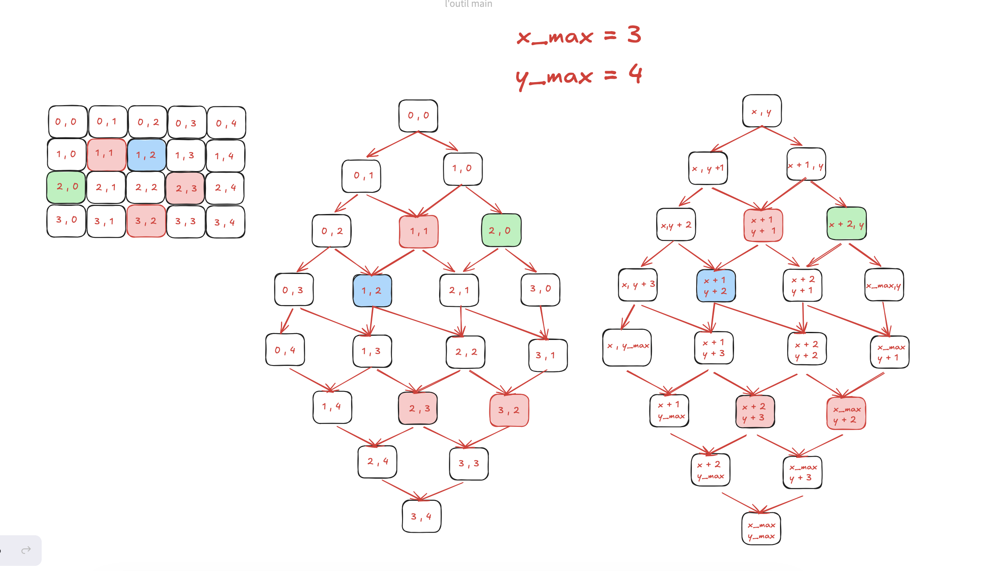

# pathfinder

Il serais aisé d apprendre un algorithme deja existant, mais j'ai decidé ici de partir de l'observation pour implementer un algorithme qui determine s'il existe un chemin valide entre un point A et un point B.

